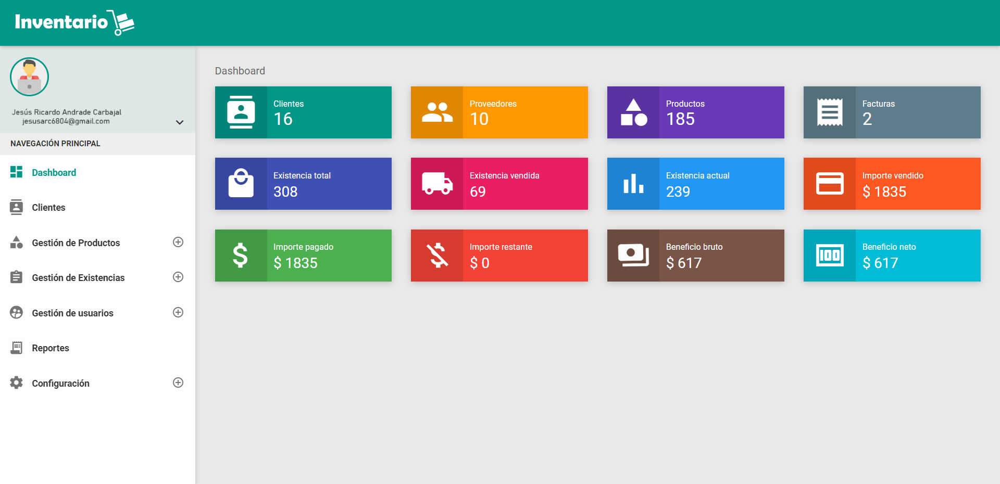

# Sistema de Gestión de Inventarios - Telas Primavera  
[](https://laravel.com/)  
[](https://vuejs.org/)  
[](https://www.mysql.com/)  

Aplicación desarrollada para **Mercería y Telas Primavera** con el fin de optimizar el control de inventarios y las operaciones de ventas.  
Incluye un **punto de venta funcional**, gestión de productos, reportes y herramientas administrativas.  

---

## 🚀 Características  
- Control de inventario en tiempo real.  
- Gestión de productos (alta, baja, edición).  
- Punto de venta con registro de transacciones.  
- Reportes de stock y ventas.  
- Interfaz de usuario dinámica construida con **Vue.js**.  
- Backend robusto con **Laravel** y base de datos en **MySQL**.  

---

## 🛠️ Tecnologías utilizadas  
- **Laravel** (Backend, API RESTful).  
- **Vue.js** (Frontend dinámico).  
- **MySQL** (Gestión de base de datos).  
- **Bootstrap** (Estilo y diseño responsivo).  

---

## 📸 Capturas de pantalla  

### Panel principal  
  


---

## 📦 Instalación y uso  

1. **Clonar el repositorio:**  
   ```bash
   https://github.com/Paleta911/Estadia-TelasPrimavera.git


